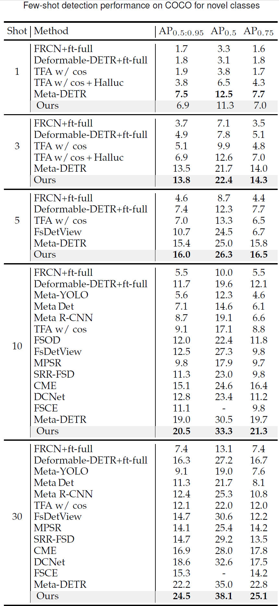

# Extended Experiments for Data-efficient Object Detection on Construction Sites  

This repository contains extended experiments for our paper "*Data-efficient Object Detection on Construction Sites Using Reweighting Mechanism and Cross-batch Contrastive Learnin*g", which has been submitted to *IEEE Transactions on Industrial Informatics*.  

## Overview  

In our work, we propose a novel few-shot detector to achieve efficient object detection on construction sites with limited labeled data. Our method incorporates a reweighting mechanism and cross-batch contrastive learning to enhance detection performance in data-scarce scenarios.  

While our primary focus is on construction site datasets, we recognize the importance of demonstrating our model's generalizability. Due to the scarcity of publicly available construction site datasets, we conducted additional experiments using the COCO dataset, a widely recognized benchmark in few-shot object detection.  

## Extended Experiments on COCO Dataset  

The results of our experiments on the COCO dataset are presented in the table below:  

  

Key findings:  
- Our method consistently outperforms Meta-DETR across different shot configurations.  
- We observe notable advantages, especially at higher $K$ values (shots).  
- The performance gains demonstrate our model's scalability, robustness, and exceptional data utilization.  

## Significance of Results  

1. **Generalizability**: Although COCO is not specific to construction sites, these experiments showcase our model's effectiveness and adaptability on a diverse and challenging dataset.  

2. **Scalability**: The consistent superiority across shot configurations, particularly at higher $K$ values, highlights our method's ability to leverage additional data effectively.  

3. **Robustness**: The performance on COCO, known for its diversity, indicates potential applicability in various challenging environments beyond construction sites.  

## Access to Full Paper  

For a comprehensive understanding of our methodology, primary experiments on construction site datasets, and detailed analysis, please refer to our full paper (link to be provided upon publication).  

## Contact  

For any questions or further information, please contact  vvgod@seu.edu.cn.